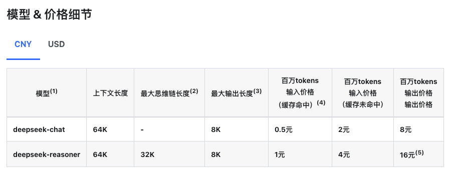

# VerboQuest
DeepSeek + GRE verbal learning

This backend simply filter the returned **word definition**
& **sample sentence** & return it back to **VerboQuest-Web**

---
### Model : deepseek-chat
### Token Price: [official link](https://api-docs.deepseek.com/zh-cn/quick_start/pricing/)

##### For one word it takes around 240 tokens to generate  *definition* & *sentence*
> 1 word => 240 tokens ~= 0.00156 RMB
>
>  1000 word => 24000 tokens ~= 1.56 RMB

---
## Project Setup
```sh
mvn clean install
```

## DeepSeek Token
```properties
spring.ai.openai.api-key=<YOUR DEEP SEEK KEY>
```
> note: average call back from DeepSeek API takes around 5 seconds.

